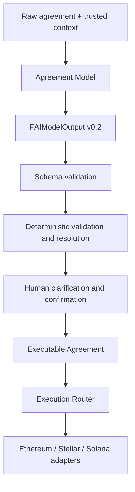

# PAI Agreement Intelligence Architecture v0.2

Status: Candidate architecture specification

## 1. Scope

PAI Agreement Intelligence transforms natural-language deal terms into a chain-neutral, source-grounded agreement representation that can be validated, clarified, confirmed, and later adapted for execution.

This document covers:

- model and deterministic-layer boundaries;
- versioned data contracts;
- chain neutrality;
- provenance and trusted context;
- human confirmation;
- execution routing; and
- failure containment.

It does not define a production model, training pipeline, chain adapter implementation, or smart-contract deployment.

## 2. Core principles

1. **AI advises.** The model extracts and flags; it does not decide or execute.
2. **Humans confirm.** Material ambiguity, missing terms, and authority require clarification or explicit confirmation.
3. **The protocol executes.** Only validated, resolved, and confirmed agreement data may reach an execution adapter.
4. **Source fidelity beats apparent completeness.** Missing values remain missing; the model does not write the contract for the parties.
5. **Deterministic code owns deterministic work.** Arithmetic, registry resolution, provenance verification, policy, and execution checks do not belong to the model.
6. **PAI Core is chain-neutral.** Chain-specific behavior is isolated behind adapters.

## 3. System flow



No path from the model goes directly to the Execution Router, chain adapter, contract call, or fund movement.

## 4. Input boundary

The model receives two conceptually separate inputs:

### 4.1 Raw agreement text

The raw text is the only source for exact issue evidence and provenance quotes. It may be plain text, dialogue, or a document excerpt.

### 4.2 Trusted context

Trusted context is structured information supplied by authenticated or explicitly confirmed systems, such as:

- authenticated participant identity;
- confirmed party role;
- confirmed pricing currency;
- confirmed settlement network;
- confirmed settlement asset; or
- a reference date and time.

Trusted context must identify its source and target path. It is not raw agreement text and MUST NOT be converted into fabricated text provenance.

Model world knowledge is not trusted context.

## 5. Agreement Model

The Agreement Model produces exactly one `pai.agreement.v0.2` object containing:

- `agreement`: extracted structured facts;
- `issues`: registered semantic defects; and
- `provenance`: exact source quotes supporting material facts.

### 5.1 Permitted operations

- direct extraction;
- approved lossless normalization;
- unique source-grounded reference resolution;
- semantic issue classification; and
- exact-quote provenance selection.

### 5.2 Prohibited operations

- arithmetic or percentage-total validation;
- token decimal/atomic-unit conversion;
- risk scoring or recommendations;
- legal analysis or judgment;
- invented acceptance or dispute rules;
- recommended evidence insertion;
- wallet inference;
- unsupported asset/network resolution;
- provenance offset generation;
- compilation or deployment assessment;
- transaction construction, signing, or submission; and
- autonomous approval, arbitration, or fund control.

## 6. Versioned data contracts

The current v0.2 contract set is:

| Contract | Responsibility |
|---|---|
| [`../schema/pai-agreement-v0.2.schema.json`](../schema/pai-agreement-v0.2.schema.json) | Canonical chain-neutral agreement facts |
| [`../schema/pai-model-output-v0.2.schema.json`](../schema/pai-model-output-v0.2.schema.json) | Model response root, semantic issues, provenance |
| [`../schema/pai-issue-codes-v0.2.json`](../schema/pai-issue-codes-v0.2.json) | Stable semantic issue taxonomy |
| [`../schema/pai-training-example-v0.2.schema.json`](../schema/pai-training-example-v0.2.schema.json) | Training and evaluation record wrapper |
| [`../annotation/annotation-guide-v0.2.md`](../annotation/annotation-guide-v0.2.md) | Annotation semantics and non-invention rules |
| [`../evaluation/evaluation-rubric-v0.2.md`](../evaluation/evaluation-rubric-v0.2.md) | Model quality, safety gates, comparison rules |

These artifacts are reviewed as one semantic version family.

## 7. Semantic issues

The model may emit only registered issues from five kinds:

- `missing_term`;
- `ambiguity`;
- `contradiction`;
- `unresolved_reference`; and
- `unsupported_term`.

Risk flags are not semantic issues. Arithmetic inconsistencies, policy findings, asset-registry mismatches, and deployment failures belong to deterministic or operational layers.

## 8. Provenance

Every material model claim should be traceable to an exact quote from raw input.

The model returns:

```json
{
  "path": "/agreement/pricing/total/amount",
  "quote": "$4,500"
}
```

The deterministic provenance verifier then:

1. confirms that the quote occurs exactly in the raw input;
2. locates all matching spans;
3. resolves or reports duplicate-span ambiguity;
4. calculates offsets; and
5. rejects fabricated evidence.

Offsets are not generated by the model.

## 9. Schema validation

Schema validation checks structural correctness only, including:

- required fields;
- permitted properties;
- types and enums;
- canonical ID syntax;
- decimal-string syntax;
- date/duration syntax;
- chain-neutral network/asset identifier syntax; and
- issue/provenance path syntax.

Schema validity does not prove semantic truth, registry correctness, arithmetic consistency, user intent, or execution safety.

## 10. Deterministic validation and resolution

The deterministic layer owns:

- payment arithmetic and percentage totals;
- consistency between total, fixed, percentage, and remainder payments;
- required-field policies for the selected execution profile;
- provenance quote verification and offsets;
- canonical currency resolution where trusted rules permit it;
- asset and network registry resolution;
- asset/network compatibility;
- token precision and atomic-unit conversion;
- risk and policy rules;
- executable-state derivation;
- adapter capability checks;
- contract compilation and deployment readiness where applicable; and
- deterministic contradictions not visible from language alone.

Deterministic findings MUST remain distinguishable from model issues.

## 11. Human clarification and confirmation

The system presents unresolved issues and deterministic findings to the parties before execution.

Human confirmation is required for material terms including:

- parties and payment direction;
- price and currency;
- settlement asset and network;
- deliverables and deadlines;
- acceptance authority and criteria;
- payment triggers;
- revision scope;
- evidence obligations;
- dispute resolver and options; and
- any correction that changes an obligation.

User confirmation produces a new resolved agreement state. It does not rewrite the original model output or its provenance history.

## 12. Executable Agreement

The Executable Agreement is a downstream object created only after:

- model-output schema validation;
- deterministic validation;
- required resolution;
- provenance verification;
- user confirmation; and
- execution-profile selection.

It may contain fields intentionally excluded from model output, such as:

- resolved participant wallet/account bindings;
- canonical chain and asset identifiers;
- atomic token amounts;
- adapter-specific parameters;
- execution-state identifiers; and
- deployment or contract references.

The Executable Agreement requires its own schema and version. It MUST NOT be treated as interchangeable with `PAIModelOutput`.

## 13. Chain-neutral core

PAI Core expresses agreement semantics without embedding one chain's execution model.

### 13.1 Agreement value versus settlement asset

An agreement may be priced in USD and settled in USDC. Pricing currency and settlement asset remain separate fields and resolution processes.

### 13.2 Network and asset identifiers

The v0.2 schema accepts CAIP-compatible identifier syntax. Syntax acceptance does not prove that an identifier exists or that an asset is valid on a network. Registry-backed deterministic resolution performs those checks.

### 13.3 Adapter isolation

Adapters translate one confirmed Executable Agreement into chain-specific operations.

An adapter owns:

- account/address validation;
- asset representation;
- transaction construction;
- fee/resource estimation;
- contract/program/instruction mapping;
- network submission;
- confirmation/finality tracking; and
- chain-specific error translation.

Chain behavior MUST NOT leak backward into model annotation rules.

## 14. Execution Router

The Execution Router selects an adapter using the confirmed execution profile. It must reject:

- unresolved network or asset identifiers;
- unsupported agreement capabilities;
- missing account bindings;
- incompatible adapter versions;
- invalid or expired confirmation state; and
- execution requests derived directly from unconfirmed model output.

The router does not ask the model how to execute a transaction.

## 15. Dispute and evidence boundary

The model may extract dispute and evidence terms the parties explicitly agreed to. It may later assist with organizing or summarizing submitted evidence in a separately versioned workflow.

It does not:

- create evidence obligations during extraction;
- decide whether evidence proves a claim;
- select a winner;
- act as the binding arbitrator; or
- submit a resolution transaction.

The intended principle remains:

> AI assists. A human arbitrator decides. The protocol records and executes the confirmed resolution.

## 16. Failure containment

| Failure | Containment behavior |
|---|---|
| Invalid JSON | Reject model response; do not repair silently |
| Schema-invalid output | Reject and record validation errors |
| Fabricated provenance | Reject affected claim and flag model failure |
| Missing/ambiguous term | Request clarification; do not guess |
| Unresolved asset/network | Stop before executable-state creation |
| Arithmetic inconsistency | Deterministic finding; request correction |
| Unsupported agreement logic | Preserve source term and require product/schema decision |
| Adapter incompatibility | Stop in router; do not reinterpret agreement semantics |
| Transaction failure | Record adapter error; do not ask model to declare success |

No failure path should silently transform an uncertain agreement into an executable one.

## 17. Training and evaluation boundary

Training records follow `pai.training-example.v0.2` and preserve:

- raw input;
- trusted context;
- exact target output;
- data origin and license;
- personal-data marking;
- review status;
- synthetic lineage; and
- leakage grouping.

Evaluation separately measures structure, agreement facts, semantic issues, provenance, and boundary discipline. Dangerous invention is capped even when other fields are accurate.

The model selected for integration must still sit behind deterministic validation and human confirmation. Benchmark performance never grants execution authority.

## 18. Security and privacy considerations

- Do not place secrets, private keys, seed phrases, authentication tokens, or unrestricted personal data into training records.
- Production-derived text requires lawful use, redaction, licensing review, and personal-data marking.
- Raw agreement text and evidence may require encryption, retention limits, and access controls.
- Logs should separate raw text, model output, validated agreement state, and execution records.
- Model prompts and outputs are untrusted input to downstream code.
- Schema validation is mandatory but not sufficient for security.

## 19. Observability

Each processing run should record:

- correlation ID;
- input and context hashes;
- model artifact and prompt versions;
- raw response hash;
- schema validation result;
- issue and provenance verification results;
- deterministic findings;
- clarification/confirmation state;
- executable-agreement version; and
- router/adapter result where execution occurs.

Sensitive raw content should not be duplicated into unrestricted logs.

## 20. Version and state transitions

Recommended high-level states:

```text
RAW
→ EXTRACTED
→ STRUCTURALLY_VALID
→ DETERMINISTICALLY_CHECKED
→ NEEDS_CLARIFICATION or READY_FOR_CONFIRMATION
→ CONFIRMED
→ EXECUTABLE
→ ROUTED
→ SETTLED or FAILED
```

State transitions require explicit validation evidence. The model cannot declare a downstream state.

## 21. Current status

Completed as candidate specifications:

- agreement schema v0.2;
- model-output schema v0.2;
- issue-code registry v0.2;
- annotation guide and adversarial fixtures;
- training-example schema and fixtures; and
- evaluation rubric and adversarial scoring fixtures.

Not yet implemented or demonstrated by these specifications:

- production dataset;
- baseline benchmark;
- trained model or adapter;
- inference service;
- deterministic Agreement Fuzzer implementation;
- user clarification workflow integration;
- Executable Agreement schema;
- multichain Execution Router; or
- production chain adapters derived from this architecture.

## 22. Event build boundary

This architecture and the v0.2 specifications are pre-event preparation for an existing PAI codebase and must be disclosed under Continuity rules.

The intended ETHOnline build begins after official kickoff and covers the new dataset, baseline benchmark, model tuning, tuned evaluation, selected deterministic intelligence, inference integration, and demo work actually completed during the event.

Repository history, tags, benchmark manifests, and the final submission must preserve this distinction.
